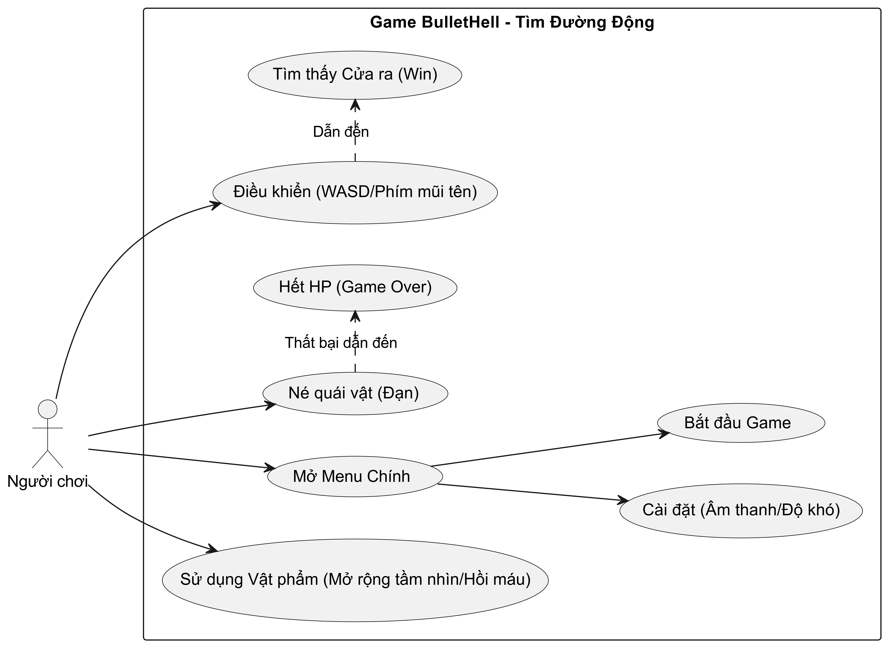

# Game Design Document: BulletHell Pathfinding

## 1. Tổng quan Lối chơi (Core Gameplay)
Dự án là sự kết hợp giữa thể loại **Maze Puzzle (Giải đố mê cung)** và **Bullet Hell (Tránh né cường độ cao)**, nhưng loại bỏ yếu tố đối kháng (combat). 

* **Bối cảnh:** Người chơi bị mắc kẹt trong một mê cung tối tăm với tầm nhìn cực kỳ hạn chế (Fog of War). 
* **Mục tiêu chính:** Sống sót, dò tìm đường đi và tìm được cổng ra (Exit) của mê cung.
* **Yếu tố Bullet Hell:** Mê cung không an toàn. Các thực thể (kẻ thù/đạn) mang hình thù kỳ dị sẽ liên tục được sinh ra. Chúng không đuổi theo người chơi ngay lập tức mà sẽ "đánh dấu" vị trí cũ của người chơi và dùng thuật toán để mò đường đến đó. Người chơi phải liên tục di chuyển, lách qua các luồng quái vật đang đan chéo nhau trong không gian hẹp của mê cung.

---

## 2. Cơ chế Người chơi (Player Mechanics)
* **Điều khiển:** Di chuyển 4 hướng (WASD hoặc Arrow Keys).
* **Tầm nhìn (Fog of War):** Người chơi chỉ nhìn thấy một vùng sáng hình tròn (Radius) xung quanh nhân vật. Phần còn lại của mê cung bị bóng tối che khuất. Những nơi đã đi qua có thể lưu lại trên minimap hoặc tối đen trở lại (tùy độ khó).
* **Tương tác:** * Không có khả năng tấn công (No Attack).
  * Chạm vào quái vật sẽ bị mất HP (Health Point). Hết HP -> Game Over.
* **Kỹ năng bổ trợ (Dự kiến):** Dùng năng lượng (Stamina) để Dash (Lướt nhanh) qua một khoảng cách ngắn nhằm né quái trong tình huống khẩn cấp.

---

## 3. Cơ chế Quái vật / "Đạn" (Enemy Mechanics)
Kẻ thù đóng vai trò như những viên "đạn" có trí tuệ trong game Bullet Hell. Chúng di chuyển liên tục tạo thành màng lưới chướng ngại vật động.

* **Cơ chế Spawn (Sinh ra):** Spawn ngẫu nhiên ở các góc khuất của mê cung hoặc tại các "ổ" cố định cách xa người chơi.
* **Cơ chế Đánh dấu (Marking):** Kẻ thù không có "tầm nhìn" hay khả năng truy đuổi liên tục. Thay vào đó, ngay tại khoảnh khắc được sinh ra (Spawn), chúng sẽ lập tức "đánh dấu" tọa độ của người chơi ngay tại thời điểm đó. Tọa độ này trở thành **điểm đích cố định** cho lần dò đường đó. Bất kể sau đó người chơi chạy đi đâu, chúng vẫn sẽ miệt mài dùng thuật toán để tìm đến đúng vị trí ban đầu được đánh dấu. (Cơ chế này tạo ra các luồng "đạn" di chuyển theo quỹ đạo phức tạp qua mê cung, cho phép người chơi phán đoán và né tránh).
* **Hệ thống Thuật toán Tìm đường (Pathfinding):**
  * **Loại 1 - Kẻ thù Mò mẫm (Sử dụng DFS - Cốt lõi):** Đây là loại kẻ thù phổ biến nhất. Do tính chất của thuật toán **Depth-First Search (Tìm kiếm theo chiều sâu)**, chúng không đi theo đường ngắn nhất. Thay vào đó, chúng sẽ chui rúc vào các ngõ ngách, đi đến tận cùng của một nhánh mê cung rồi mới quay lại (backtrack). Điều này tạo ra hướng di chuyển cực kỳ dị thường, khó đoán, khiến người chơi dễ bị "chặn đầu" bất ngờ.
    * **Cơ chế Quay lui (Backtracking):** Vì là tìm kiếm mù, chúng sẽ sục sạo đi sâu vào tận cùng của một nhánh mê cung. Khi đụng phải tường hoặc "đường cụt" (Dead end), chúng sẽ kích hoạt cơ chế quay lui (Backtrack) từng bước một để tìm ngã rẽ lân cận chưa đi qua. 
    * **Hiệu ứng Gameplay:** Hành vi này khiến quỹ đạo của quái vật cực kỳ ngoằn ngoèo, phi logic và dị thường. Người chơi có thể vừa thở phào khi thấy quái vật đi lố vào đường cụt, thì ngay giây sau đã thấy nó "bò lùi" ra và chặn ngay lối thoát duy nhất.
  * **Loại 2 - Kẻ thù Truy vết (Sử dụng BFS hoặc A* - Mở rộng):** Sinh ra với số lượng ít hơn. Loại này sẽ tính toán đường đi ngắn nhất đến vị trí đã đánh dấu. Phối hợp cùng loại 1 (DFS) sẽ tạo ra "lưới đạn" (Bullet hell) đan chéo nhau, bắt buộc người chơi phải vận dụng kỹ năng lách góc.
* **Hành vi sau khi đến đích:** Khi đến được điểm đã đánh dấu mà không trúng người chơi, chúng sẽ tiếp tục "đánh dấu" vị trí mới, hoặc tự hủy, hoặc đi tuần tra ngẫu nhiên (Roaming).

---

## 4. Cơ chế Bản đồ (Map/Environment)
* **Cấu trúc:** Mê cung dạng lưới (Grid-based). Tường (Wall) là vật cản không thể đi xuyên qua đối với cả người chơi và quái vật.
* **Tính động (Dynamic):** Cửa ra (Exit) và vị trí bắt đầu (Start) được đặt ngẫu nhiên ở mỗi màn chơi.
* **Vật phẩm (Items):** Có thể rải rác các vật phẩm hồi máu hoặc vật phẩm mở rộng tầm nhìn tạm thời (Flare/Torch).

# Diagram in Games

## Use Case Diagram (Planned)

## Class Diagram (Planned)

## Sequence Diagram (Planned)
